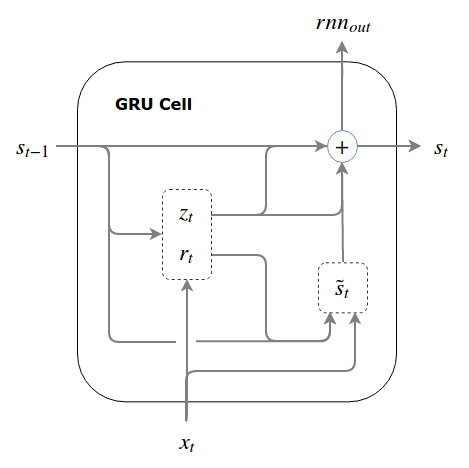

# LSTMs and GRUs

## Introduction

In this lesson, we'll learn about two advanced types of neurons that typically outperform basic RNNs, **_Long Short Term Memory Cells_** and **_Gated Recurrent Units_**! We'll explore the problems they solve that increase their effectiveness compared to traditional vanilla RNNs, and compare and contrast the two neurons types to get a feel for what exactly they do and how they do it!

## Objectives

You will be able to:

* Explain the the problem of vanishing and exploding gradients, and why they are a problem when training RNNs
* Demonstrate an understanding of the basic architecture and function of a Long Short Term Memory cell
* Demonstrate an understanding of the basic architecture and function of a Gated Recurrent Unit

## RNNs and Gradient Problems

One of the biggest problems with standard Recurrent Neural Networks is that they get **_Saturated_**. The problem with this it that they use a sigmoid or tanh activation function, and there are large areas of each function where the derivative is very, very close to 0. When the derivatives are low, this means the weight updates are small, which means that the "learning" of the model slows to a crawl! This happens because after many, many weight updates, many weights will have been pushed into an extremely positive or extremely negative value. All we have to do is get past -5 or +5 to get to very small values. 

When gradients are close to 0 because the values are extremely low, this is called **_Vanishing Gradient_**. Similarly, networks can also get the point where the gradients are much, much too large, resulting in massive weight updates that cause the model to thrash between 1 extremely wrong answer and another. When this happens, it is called **_Exploding Gradient_**. In practice, we can easily solve Exploding Gradients by just "clipping" the weight updates by bounding them at a maximum value. However, there's no good solution for Vanishing Gradients!

An intuitive way to think of this in terms of Information Theory is that happens because the network is trying to contain too much information from all of the time steps. Take a look at the following diagram, which we saw in the previous lesson. Pay attention to the colors that represent each word:

Notice how the further along the sequence goes, the less overall area the Navy Blue color (for the first word, "What") gets. As each new word in the sequence gets processed, the amount of "room" our RNN has to remember things get saturated. It turns out, remembering too many things is a pretty surefire way to get your model to crash and burn. This makes it hard for dealing with long-term dependencies in the data. For instance, consider the following sentence:

> "Marilyn studied in France during the summer and fall semesters of college in 2016. As a result, she speaks fluent {_}"

If we were to use a traditional RNN to predict the next word in this sentence, it would likely have trouble figuring out the answer because of the number of time steps between the word to predict and the word that contains the information necessary to make a prediction, "France". 

## Remembering and Forgetting

This is where the modern versions of RNNs come in. In practice, when building models for Sequence Data, people rarely use traditional RNN architectures anymore. Instead they make use of **_LSTMs_** and **_GRUs_**. Both of these models can be thought of as special types of neurons that can be used in an RNN. Although they work a little differently, they have the same strength--the ability to **_forget information_**!  By constantly updating their internal state, they can learn what is important to remember, and when it is okay to forget it. 

Consider the word prediction example we just looked at. We clearly need to remember the word "France", but there are plenty of words in between France and the word we need to predict that aren't that important, and we can safely ignore, such as "during the", "and", "of", etc. Furthermore, let's assume that our model learns enough to answer this question, but the next thousand words in the sequence is about something completely different. Do we really still need to hold on to our information about where Marilyn studied? How can we tell when we need to remember something and when we need to forget something? This is where GRUs and LSTMs have different approaches. Let's take a quick look at how they both work. 

## Gated Recurrent Units (GRUs)

**_Gated Recurrent Units_**, or **_GRUs_**, are a special type of cell that passes along it's internal state at each time step. However, not every part of the internal state is passed along--only the important stuff! GRUs make use of two "gate" functions: a **_Reset Gate_**, which determines what should be removed from the cell's internal state before passing itself along to the next time step, and an **_Update Gate_**, which determines how much of the state from the previous time step should be used in the current time step. 

The following technical diagram shows the internal operations of how a GRU cell works. Don't worry about trying to understand what every part of this diagram means--internally, its just some equations for the Update and Reset operations, coupled with matrix multiplication and sigmoid functions. Instead, focus on the the $S_t$ line, which moves from left to right and denotes the state being updated and passed onto the next layer. 

## Long Short Term Memory Cells (LSTMs)

**_Long Short Term Memory Cells_**, or **_LSTMs_**, are another sort of specialized neurons for use in RNNs that are able to effectively learn what to remember and what to forget in sequence models. 

LSTMs are generally like GRUs, except that they use 3 gates instead of 2. LSTMs have: 

* an **_Input Gate_**, which determines how much of the cell state that was passed along should be kept
* an **_Forget Gate_**, which determines how much of the current state should be forgotten
* an **_Output Gate_**, which determines how much of the current state should be exposed to the next layers in the network

As you can see, they essentially accomplish the same thing as GRUs--they just do it in a slightly different way. Both models do a great job learning patterns from sequences, even when they are long and extremely complex! You'll find a diagram of an LSTM cell below. Just like with GRUs, don't worry about what the symbols mean or the math is behind it--you can always pick that up later if you're curious, although it's not really necessary to know the math to make use the cells in modeling. Instead, try to focus on how the information flows through this diagram from left to right, and where the various gates are for each function performed!

There's no good answer yet as to whether GRUs or LSTMs are superior to one another. In practice, GRUs tend to have a slight advantage in many use cases, but this is far from guaranteed. In practice, the best thing to do is to build a model with each and see which one does better--which is exactly what we'll do in the next lab!

## Summary

In this lesson, we learned about how LSTMs and GRUs can help our models avoid problems such as vanishing and exploding gradients when working with large sequences of data. We also learned about the structure of LSTMs and GRUs, and how they are able to "forget" information!
